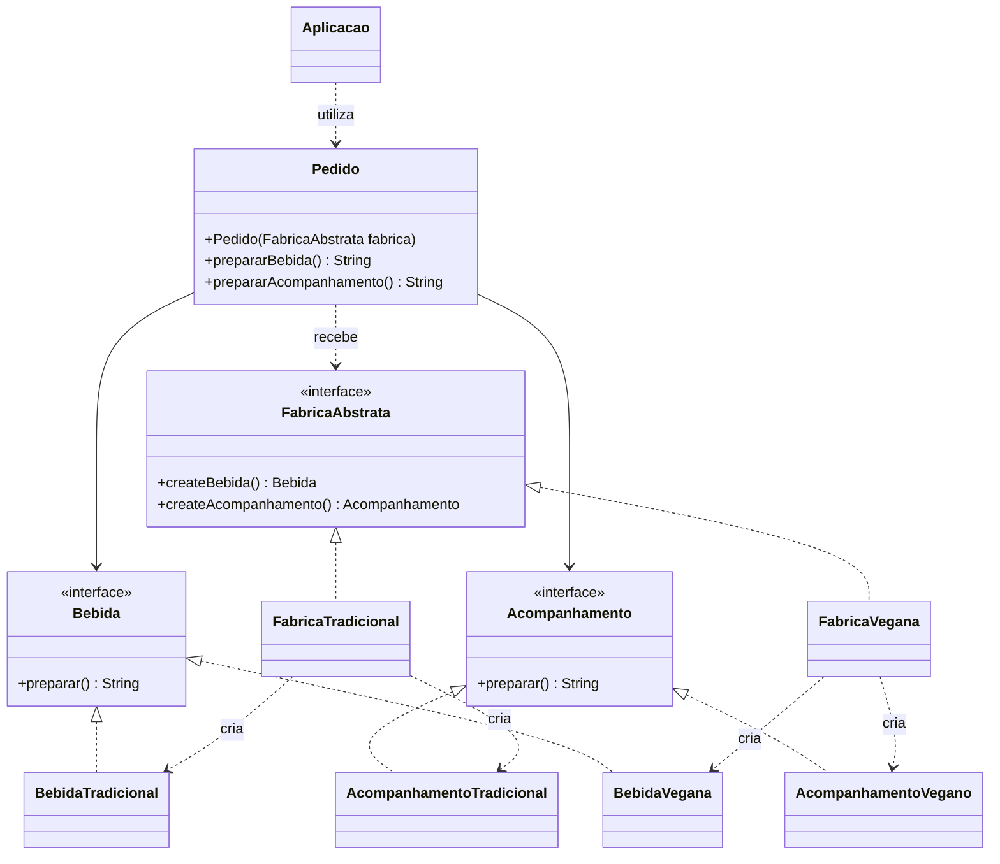

# Padrão Abstract Factory

Projeto desenvolvido para demonstrar a utilização do padrão de projeto **Abstract Factory** em Java.

## 📌 Sobre o projeto

O projeto simula um sistema de **cafeteria com diferentes famílias de combos**.

O padrão Abstract Factory permite criar bebidas e acompanhamentos de uma mesma família, sem que a classe responsável pelo pedido precise conhecer diretamente as classes concretas desses produtos.

Neste projeto existem dois tipos de combo:

- **Tradicional:** cappuccino com leite integral e pão de queijo tradicional.
- **Vegano:** cappuccino com leite de aveia e bolo de banana vegano.

## 🧩 Padrão Abstract Factory

O **Abstract Factory** é um padrão de projeto criacional que fornece uma interface para criar famílias de objetos relacionados sem especificar suas classes concretas.

Neste projeto, a interface `FabricaAbstrata` define os métodos de criação:

```java
Bebida createBebida();
Acompanhamento createAcompanhamento();
```

As classes que implementam essa interface são responsáveis por determinar quais produtos serão criados.

Dessa forma:

```text
FabricaTradicional
        ├── BebidaTradicional
        └── AcompanhamentoTradicional
```

E:

```text
FabricaVegana
        ├── BebidaVegana
        └── AcompanhamentoVegano
```

Isso permite adicionar novas famílias de combos sem modificar a implementação da classe `Pedido`.

## 📁 Estrutura do projeto

```text
Padr-o-Abstract-Factory/
│
├── src/
│   ├── main/
│   │   └── java/
│   │       └── padroescriacao/
│   │           └── abstractfactory/
│   │               ├── Acompanhamento.java
│   │               ├── AcompanhamentoTradicional.java
│   │               ├── AcompanhamentoVegano.java
│   │               ├── Aplicacao.java
│   │               ├── Bebida.java
│   │               ├── BebidaTradicional.java
│   │               ├── BebidaVegana.java
│   │               ├── FabricaAbstrata.java
│   │               ├── FabricaTradicional.java
│   │               ├── FabricaVegana.java
│   │               └── Pedido.java
│   │
│   └── test/
│       └── java/
│           └── padroescriacao/
│               └── abstractfactory/
│                   ├── FabricaTest.java
│                   └── PedidoTest.java
│
├── pom.xml
└── README.md
```

## ⚙️ Funcionamento

As interfaces `Bebida` e `Acompanhamento` definem o método `preparar()`, que retorna a descrição do produto.

As classes `BebidaTradicional` e `BebidaVegana` implementam a interface `Bebida`. Já as classes `AcompanhamentoTradicional` e `AcompanhamentoVegano` implementam a interface `Acompanhamento`.

A interface `FabricaAbstrata` define os métodos responsáveis pela criação desses produtos. Cada fábrica concreta cria uma família específica:

| Fábrica | Bebida | Acompanhamento |
| --- | --- | --- |
| `FabricaTradicional` | Cappuccino com leite integral | Pão de queijo tradicional |
| `FabricaVegana` | Cappuccino com leite de aveia | Bolo de banana vegano |

A classe `Pedido` recebe uma fábrica pelo construtor e utiliza seus métodos para criar a bebida e o acompanhamento. Depois, disponibiliza os métodos `prepararBebida()` e `prepararAcompanhamento()` para obter a descrição de cada item.

Assim, `Pedido` trabalha com as interfaces dos produtos sem precisar conhecer diretamente suas classes concretas. Caso receba uma fábrica nula, o construtor lança uma `IllegalArgumentException` com a mensagem `Fábrica obrigatória`.

A classe `Aplicacao` demonstra o funcionamento criando e exibindo os dois combos no console.

### Executando a aplicação

Com o **JDK 11 ou superior** e o **Maven** instalados, execute na pasta do projeto:

```bash
mvn compile
java -cp target/classes padroescriacao.abstractfactory.Aplicacao
```

Saída esperada:

```text
Combo tradicional
Cappuccino com leite integral
Pão de queijo tradicional

Combo vegano
Cappuccino com leite de aveia
Bolo de banana vegano
```

## 🏗️ Estrutura do Abstract Factory

Os elementos do padrão utilizados no projeto podem ser identificados da seguinte forma:

| Elemento do Abstract Factory | Implementação |
| --- | --- |
| Abstract Factory | `FabricaAbstrata` |
| Concrete Factory | `FabricaTradicional` |
| Concrete Factory | `FabricaVegana` |
| Abstract Product | `Bebida` |
| Abstract Product | `Acompanhamento` |
| Concrete Product | `BebidaTradicional` |
| Concrete Product | `BebidaVegana` |
| Concrete Product | `AcompanhamentoTradicional` |
| Concrete Product | `AcompanhamentoVegano` |
| Client | `Pedido` |

Essa organização permite separar a lógica de utilização dos produtos da lógica responsável pela criação de cada família.

## 🧪 Testes

O projeto possui testes automatizados utilizando **JUnit 5**.

Os oito testes estão distribuídos entre as classes:

- **`FabricaTest`:** verifica se as fábricas criam bebidas e acompanhamentos dos tipos correspondentes às famílias tradicional e vegana.
- **`PedidoTest`:** verifica as descrições dos produtos, a rejeição de uma fábrica nula e a possibilidade de utilizar uma nova família sem alterar a classe `Pedido`.

Para executar os testes utilizando Maven:

```bash
mvn test
```

## 📊 Diagrama de Classes

O diagrama abaixo representa a relação entre as fábricas, as interfaces dos produtos, suas implementações e a classe `Pedido`.



## 🛠️ Tecnologias utilizadas

- Java 11
- Maven
- JUnit 5
- Padrões de Projeto — Abstract Factory

## 🎯 Objetivo

O objetivo deste projeto é demonstrar de forma prática a aplicação do padrão **Abstract Factory**, separando a criação de famílias de produtos de sua utilização.

Com essa abordagem, novas famílias de combos podem ser adicionadas através da criação de novas implementações de `Bebida` e `Acompanhamento`, junto de uma nova implementação de `FabricaAbstrata`, reduzindo o acoplamento entre as classes.

## 👨‍💻 Autor

**Felipe Baba**

Projeto desenvolvido para fins acadêmicos, como aplicação prática do padrão de projeto **Abstract Factory**.
